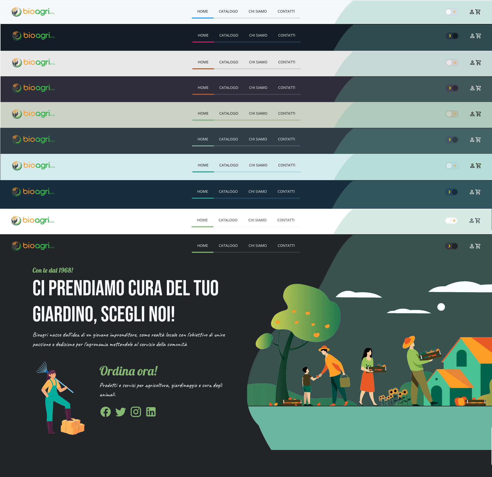

# bioagri-website

[](https://travis-ci.com/nefele-org/nefele-desktop)
[](https://lgtm.com/projects/g/nefele-org/nefele-desktop/alerts/)
[](https://lgtm.com/projects/g/nefele-org/nefele-desktop/context:java)
[](/LICENSE)

## Descrizione :it:
L’applicativo web sviluppato è uno strumento pensato per consentire la vendita
di servizi e prodotti da parte di una realtà aziendale esistente: BioAgri S.r.l.s. -
azienda che opera nel settore agrario distribuendo ed erogando servizi di
consulenza e prodotti per il giardinaggio, coltura, e strumenti per l’agronomia.  

Il progetto prevede uno sviluppo di un’architettura modello **Client-Server**, con
standard di comunicazione **RESTful** e supporto multilingua per una fruizione
multipiattaforma di un’applicazione web orientata allo **shopping online** e
all’ingresso della stessa nel mercato digitale globale.  

La piattaforma offre ai clienti, acquisiti e potenziali, tutte le informazioni e i
consigli necessari sia nella fase di pre-vendita che di post-vendita.  

Tramite un’interfaccia molto semplice e intuitiva l’utente ha la possibilità di
visionare una vetrina che evidenzia le principali informazioni riguardo la
sopracitata azienda e in seguito accedere al catalogo dei prodotti, per mezzo
del quale effettuare eventuali operazioni d’acquisto.  
  
### Screenshots



## Instructions :en:
Clone sources from this repository:
```shell
$ git clone --depth=1 https://github.com/bioagrisrls/bioagri-website
```
## Prerequisites

- Docker
- Docker Compose (provided by Docker Desktop on Windows)
- NodeJS
- PostgreSQL

## Docker / Docker Compose
You can download Docker from [Docker Website](https://www.docker.com/get-started)

### NodeJS
In order to run building you need to install NodeJS dependencies, so open your project directory and execute the following command:
```shell
$ npm install
```

### PostgreSQL
 **NOTE:** If you already own a PostgreSQL installation, skip to step 3.

In order to install PostgreSQL, we provide a ```docker-compose.yml``` script file inside ```utils/postgres``` directory.  
Run it with following command:
```shell script
$ cd utils/postgres
$ sudo docker-compose -d up
```

#### 1. Open PgAdmin4
After successful running, open your web browser e go to: http://localhost:5050 or open your PgAdmin4 application  
Authenticate yourself with:
```shell
Username: admin@web.unical.it
Password: admin
```

#### 2. Setup a new Server
Setup a new server with these following properties:
```shell
Host: postgres
Username: admin
Password: admin
```

#### 3. Create and restore database
1. Create a new database named ```bioagridb```
2. Open *Tools->QueryTool* from the top menu and paste all the content from ```utils/database/prefab.sql```

**NOTE:** If you get error about *role admin*, try with ```utils/database/prefab.alternative.sql```

#### 4. Set user/password in application.yml
**NOTE:** Only if you have a custom installation of PostgreSQL, otherwise just skip.

Open with your editor ```back-end/src/main/resources/application.yml``` and set your PostgreSQL credentials:
```yaml
# ...
    POSTGRES_USER: INSERT_YOUR_USERNAME
    POSTGRES_PASSWORD: INSERT_YOUR_PASSWORD
# ...
```

## Build

**NOTE:** Building from sources requires **JDK 15.0.x**, you can download directly and unzip it from [OpenJDK Archive](https://jdk.java.net/archive/):
* [Windows](https://download.java.net/java/GA/jdk15.0.1/51f4f36ad4ef43e39d0dfdbaf6549e32/9/GPL/openjdk-15.0.1_windows-x64_bin.zip)
* [Mac](https://download.java.net/java/GA/jdk15.0.1/51f4f36ad4ef43e39d0dfdbaf6549e32/9/GPL/openjdk-15.0.1_osx-x64_bin.tar.gz)
* [Linux](https://download.java.net/java/GA/jdk15.0.1/51f4f36ad4ef43e39d0dfdbaf6549e32/9/GPL/openjdk-15.0.1_linux-x64_bin.tar.gzhttps://download.java.net/java/GA/jdk15/779bf45e88a44cbd9ea6621d33e33db1/36/GPL/openjdk-15_linux-x64_bin.tar.gz)

You need to set **JAVA_HOME** environment variable to point to your Java 15 directory, before running Gradle Wrapper.  
Or execute following command (keep your terminal open!)

```shell
# Linux/Mac
export JAVA_HOME=/path_to_jdk_15

# Windows
set JAVA_HOME="X:\path_to_jdk_15"
```

Finally to run BioagriShop, execute the following command in the project root:
```shell
# Linux/Mac
$ ./gradlew :front-end:run --console=rich

# Windows (CMD)
> gradlew.bat :front-end:run --console=rich
```

## Run
Open your web browser on http://localhost:8080 after successful build.

## License

Copyright (c) Bioagri S.r.l.s. All rights reserved.

Licensed under the [MIT](/LICENSE) license.

